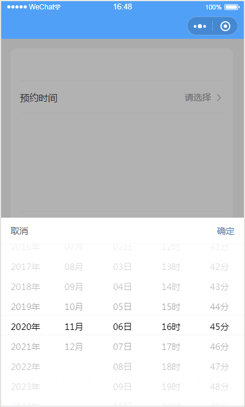
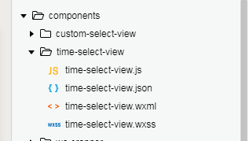

# time-select-view
微信小程序端的时间选择器,年月日时分

#### 展示:



```
<time-select-view
  id="time-select-view" 
  currentTime="{{date}}" 
  bindonTimeSelectCancel="onTimeSelectCancel" 
  bindonTimeSelected="onTimeSelected">
</time-select-view>
```

#### 使用:

###### 1.将组件引入项目中components文件夹中



###### 2.在对应页面中引入组件

.json:

```
{
  "usingComponents": {
    "time-select-view": "../../components/time-select-view/time-select-view"
    ...
  },
  ...
}
```

.wxml:

```
<time-select-view
  id="time-select-view" 
  currentTime="{{date}}" 
  bindonTimeSelectCancel="onTimeSelectCancel" 
  bindonTimeSelected="onTimeSelected">
</time-select-view>
```

|           属性           |                   说明                   |
| :--------------------: | :------------------------------------: |
|      currentTime       | 设置当前已选择的时间,用于每次打开的时候显示当前已选择的时间,默认为当前时间 |
| bindonTimeSelectCancel |           用户点击取消的回调函数(一般没用)            |
|   bindonTimeSelected   |              用户点击确定的回调函数               |

###### 3.设置数据

.js:

```
data: {
    date: '',
},
```

###### 4.显示隐藏

```
//显示
this.selectComponent('#time-select-view').show()
//隐藏
this.selectComponent('#time-select-view').hide()
```

###### 5.回调函数

```
  onTimeSelected: function(e){
    this.setData({
      date: e.detail.ymdhm
    })
  },,
```


